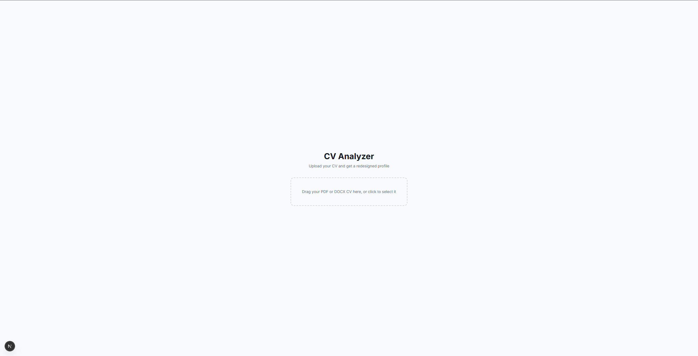
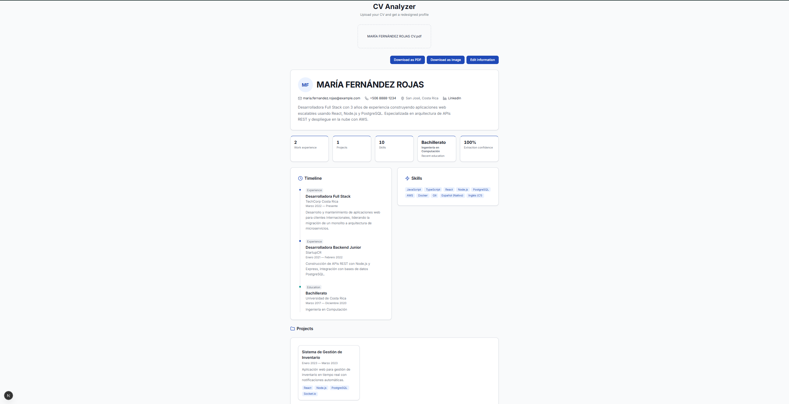
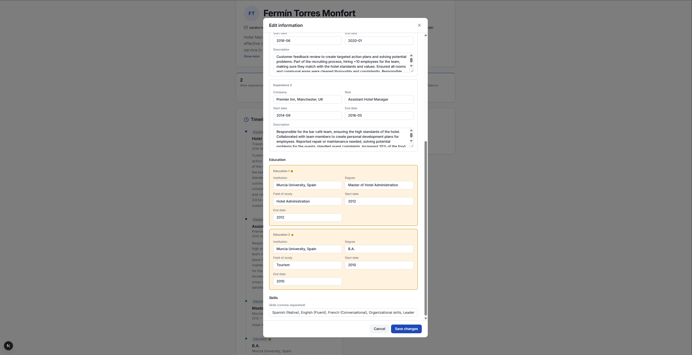
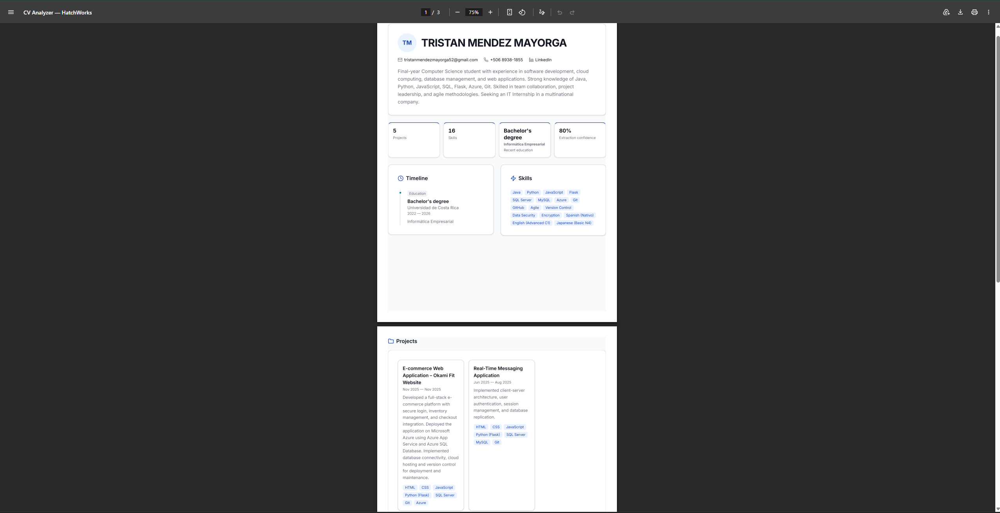

# HatchWorks CV Analyzer

HatchWorks AI technical challenge submission — a CV analyzer that extracts structured profile data from uploaded resumes and displays it in a reimagined viewer.

## Screenshots

### Upload screen



The home page upload area where users drag or select a PDF or DOCX file.

### Redesigned profile



The results view after extraction: profile header, stats cards, timeline, skills, and projects.

### Edit modal



The edit modal for correcting extracted fields before finalizing the profile.

### PDF export



The print preview opened by "Download as PDF", showing the redesigned layout ready to save or print.

## Installation and local setup

### Prerequisites

- **Node.js 20.9+** (required by Next.js 16; LTS 20.x or 22.x recommended)
- **npm** (included with Node)

### Steps

1. Clone the repository and install dependencies:

```bash
git clone https://github.com/TristanMM/hatchworks-cv-analyzer.git
cd hatchworks-cv-analyzer
npm install
```

2. Copy the environment template and add your Anthropic API key:

```bash
cp .env.example .env.local   # Windows: copy .env.example .env.local
```

Edit `.env.local` and replace the placeholder with your real key:

```
ANTHROPIC_API_KEY=sk-ant-...
```

`.env.local` is gitignored — never commit the real key.

3. Start the development server:

```bash
npm run dev
```

Open [http://localhost:3000](http://localhost:3000).

4. **(One-time, for E2E tests)** Install Playwright browser binaries:

```bash
npx playwright install
```

Chromium, Firefox, and WebKit are downloaded to Playwright's local cache on your machine — they are **not** stored in this repository. Every fresh clone needs this step before running E2E tests.

### Running tests

| Command | Purpose |
|---------|---------|
| `npm run test` | Vitest unit tests |
| `npm run test:e2e` | Playwright E2E (`e2e/cv-analyzer.spec.ts`) |

For E2E tests, start `npm run dev` in a separate terminal first — Playwright expects the app at `http://localhost:3000`. Tests that exercise the extraction flow also require a valid `ANTHROPIC_API_KEY` in `.env.local`.

## Architecture decisions

The app is a single Next.js project (TypeScript, App Router) deployed on Vercel, with no separate backend service and no database. Each decision below was made for a specific reason, not just because it's a common default.

- **Next.js full-stack instead of a separate frontend/backend.** One repo and one deploy means no CORS configuration, no split between "where does this run" for the client and the API, and less risk of "works on my machine" bugs that only show up once frontend and backend are deployed independently.
- **No database, fully stateless flow.** The app extracts data from one CV and renders it in the same session — there is nothing that needs to persist across requests. Skipping a database avoids an entire class of setup, migrations, and failure modes that this challenge doesn't call for.
- **Per-field confidence system (`high` / `low` / `missing`).** The challenge explicitly doesn't require perfect extraction accuracy. Instead of quietly leaving a field blank or having the model guess at a value that isn't really there, every field carries an explicit trust signal so the UI can flag uncertain data instead of hiding the gap or presenting a guess as fact.
- **`window.print()` with dedicated print CSS instead of a PDF-generation library.** A library like Puppeteer is heavy, slow to cold-start in a serverless function, and is the single piece most likely to break once deployed. The browser's native print pipeline needs no extra dependency and behaves the same in development and production.
- **`html2canvas-pro` instead of the original `html2canvas`.** The stock library can't parse modern CSS `oklch()` color values, which Tailwind v4's default palette uses — it either throws or produces a broken capture. `html2canvas-pro` is a maintained fork that adds `oklch()` support, so the PNG export matches what's actually on screen.

## Data extraction approach and tradeoffs

The extraction pipeline is hybrid: a plain-text parser first, then an LLM call to structure that text, then schema validation. Each stage exists to compensate for what the others can't do well on their own.

- **Text parser (`pdf-parse` / `mammoth`) + LLM (Claude), instead of only regex or only an LLM.** The parser gets the raw text out of a PDF or DOCX cheaply and deterministically. The LLM then does the part that regex genuinely can't: turning free-form text that's laid out differently in every CV into one fixed schema, without writing and maintaining hundreds of brittle format-specific rules.
- **Claude Haiku, not a larger model.** This task is structured extraction — read text, fill in a fixed schema — not open-ended reasoning. Haiku is fast and inexpensive, which fits both the nature of the task and the reality of running it once per uploaded CV.
- **Confidence is assigned by the model, not inferred afterward.** Claude is instructed to mark every field `high`, `low`, or `missing` as part of the same call that extracts the data, because the model is the one actually looking at the ambiguity in the source text (an unclear date format, a section that doesn't map cleanly to a field). Reconstructing that judgment after the fact, from the structured output alone, would be guessing at a guess.
- **Schema extended mid-project to add a `projects` array.** The schema initially only had `experience` and `education`. In practice, many CVs from this challenge's target audience — students and early-career candidates — have no formal work history at all, only academic or personal projects. Treating "no experience" as "no data" would have hidden exactly the material most relevant to that audience, so `projects` was added as its own top-level field rather than folded into `experience`.
- **Real troubleshooting example: a `pdf-parse` worker path bug under Next.js bundling.** `pdf-parse` (via `pdf.js`) locates its worker script using a path relative to its own location inside `node_modules`. Next's bundler rewrote that relative path when compiling the server code, so the worker failed to load. The fix has two parts: `serverExternalPackages: ["pdf-parse", "@napi-rs/canvas"]` in `next.config.ts` keeps those packages out of the server bundle entirely, and `import "pdf-parse/worker"` at the top of `lib/extraction/parsePdf.ts` — before importing `PDFParse` — registers the real worker first, so `pdf.js` never falls back to the broken path.
- **Working around Anthropic's structured-output limits.** The JSON schema sent to Claude can't mark nullable text fields with a union type (e.g. `{"type": ["string", "null"]}`): Anthropic caps structured-output requests at 16 parameters using union types, since each one adds real cost to compiling the response grammar, and this schema has roughly 19 nullable text fields. The workaround: every nullable field is typed as a plain `string`, the model returns `""` when a value is missing, and a normalization step converts `""` back to `null` before validating against the app's real `CVData` schema — so the rest of the codebase never has to know the workaround exists.

## Extra features implemented

Beyond the core PDF upload and extraction flow, these optional challenge extras were implemented:

- **DOCX support** — upload and extract from Word documents (`.docx`) in addition to the required PDF format.
- **Bilingual CV support (Spanish / English)** — the extraction prompt preserves the CV's original language; no separate locale setting is required.
- **Field editing before finalizing** — an in-memory edit modal lets you correct extracted data; fields with low or missing confidence are highlighted, and edited fields are automatically promoted to high confidence.
- **Multiple download formats** — export the redesigned profile as a PDF (via the browser print dialog) or as a PNG image.
- **Confidence indicators** — low-confidence and missing fields show a visual badge in the results view so you know what to double-check.

## Known limitations

The app works end-to-end for its main flows, but these gaps are worth knowing about before evaluating or extending it.

### Design system consistency

`Button.tsx` (`bg-blue-600`, `bg-gray-100`) and `FileUploader.tsx` (`border-gray-300`, `text-gray-500`, etc.) still use hardcoded Tailwind palette classes instead of the semantic design tokens defined in `globals.css`. The upload page title and subtitle in `app/page.tsx` (`text-gray-500`) have the same gap. The results view was migrated to tokens; these early components were not.

### Extraction and editing

- **`confidence` is section-level, not per-entry.** The schema stores one value for an entire array (e.g. `confidence.experience`), not a separate value for each job or degree. The edit modal reflects this: every experience, education, or project card shares the same confidence badge. This is a deliberate schema choice, documented in the modal's behavior and in `promoteConfidence`.
- **Editing is correction-only for existing entries.** The edit modal lets you fix text in already-extracted rows but cannot add or remove entire entries in `experience`, `education`, or `projects`.

### Testing and edge-case coverage

- **Two-column CV layouts were not explicitly tested.** The PDF parser and extraction prompt should handle them reasonably, but no dedicated fixture or test case was run for this layout (it is listed in `testing.md` but not yet covered).
- **`STRICT_RETRY_INSTRUCTIONS` omits `"projects"` from its top-level keys list** in `extractWithClaude.ts` — a pre-existing gap unrelated to the later fix that added `"summary"`. It only affects the rare path where the first Claude response fails validation and triggers a retry (project *fields* are still listed separately in the retry prompt).
- **TestSprite MCP could not drive E2E file-upload tests from Cursor.** The `test-file-upload` capability exists only in TestSprite's Web Portal, not in the MCP integration available in the IDE. E2E coverage was implemented with Playwright locally instead.

## What I would improve with more time

With another sprint, these would be the highest-value follow-ups:

- **Finish the design-system migration** — replace remaining hardcoded colors in `Button.tsx`, `FileUploader.tsx`, and the upload page heading with semantic tokens from `globals.css` so the whole app shares one palette.
- **Extract `extractLatestYear` into a shared utility** — the function is copy-pasted across `StatsCards`, `ProfileView`, `ExperienceTimeline`, and `ProjectsGrid`. Keeping it inline was a deliberate choice to minimize diff size while the visual design was still changing; with the layout settled, a single `lib/utils/` helper would be the cleaner home.
- **Close small extraction gaps** — add `"projects"` to the top-level keys checklist in `STRICT_RETRY_INSTRUCTIONS`; add a dedicated two-column CV fixture and test case.
- **Richer editing and finer confidence** — extend the schema to support per-entry confidence paths and allow adding/removing rows in the edit modal, not just correcting extracted text.

## AI-assisted work disclosure

AI was used throughout this project as a development accelerator — not as an unsupervised author. The division of responsibility was deliberate and consistent.

### Role split

**What the AI did (Cursor + Claude)**

- Drafted and structured implementation plans for each task before any code was written
- Implemented those approved plans as the coding agent (development tasks, refactors, fixes)
- Generated and ran automated tests (Vitest unit tests and Playwright E2E tests)

**What I did**

- Defined all project context and domain knowledge upfront via the Context Packs: `agents.md`, `context.md`, `conventions.md`, `testing.md`, and `architecture.md`
- Reviewed and approved every plan before execution — including catching and correcting technical issues, scope creep, and edge cases the AI missed
- Validated and supervised all test results and functionality manually before accepting work as done

### GenDD methodology

This project followed **GenDD (Generative-Driven Development)**, HatchWorks' own methodology for AI-assisted software development. Rather than treating AI as a code autocomplete tool, GenDD defines a structured workflow where the human stays in control of direction and the AI handles execution within approved boundaries.

That workflow — the **Execution Loop** — was applied to essentially every task across all days of the challenge: **Context → Plan → Confirm → Execute → Validate**. Cursor's Plan Mode was used to review AI-generated plans before approving execution; code was never written without an approved plan first. This was a deliberate methodological choice — GenDD is the client's own framework — not simply a preference for using AI tools. The behavior rules enforced on the AI during execution are documented in [`agents.md`](agents.md).

## How to run tests

### Vitest (unit tests)

```bash
npm run test
```

Runs all unit tests (67 tests covering the extraction pipeline, file validation, and UI logic helpers). Test files follow the convention `*.test.ts` colocated next to the module they test (for example, `lib/extraction/parsePdf.test.ts` beside `parsePdf.ts`).

### Playwright (E2E)

```bash
npm run test:e2e
```

Runs 5 end-to-end flows in `e2e/cv-analyzer.spec.ts`: valid CV upload, invalid file rejection, PDF download, PNG download, and field editing.

**Before running:** start the dev server (`npm run dev`) in a separate terminal — Playwright expects the app at `http://localhost:3000`. Extraction flows also need a valid `ANTHROPIC_API_KEY` in `.env.local`.

**First-time setup:** run `npx playwright install` once to download browser binaries (see step 4 in [Installation and local setup](#installation-and-local-setup)).

## Deployment

The app is deployed on [Vercel](https://vercel.com) with automatic deployments on every push to `main`.

**Live URL:** [https://hatchworks-cv-analyzer.vercel.app/](https://hatchworks-cv-analyzer.vercel.app/)

### Environment variables

Set the following in the Vercel project settings (Settings → Environment Variables):

| Variable | Required | Description |
|----------|----------|-------------|
| `ANTHROPIC_API_KEY` | Yes | Anthropic API key for the CV extraction pipeline (server-side only) |

Without this key, uploads will fail at the extraction step. Never expose it to the client — it is read only in the `/api/extract` server route.

### Production considerations

Uploads are capped at **4 MB**, matching Vercel's serverless function payload limit. This keeps file validation aligned with what the deployed API route can actually accept (see [Architecture decisions](#architecture-decisions) — the backend runs as Vercel serverless functions, not a long-running server).
