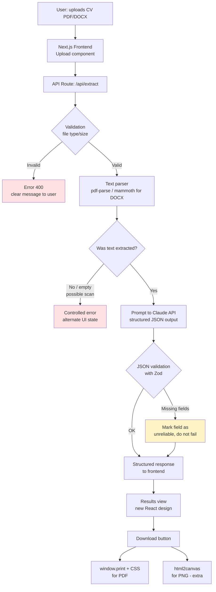

# architecture.md — System architecture

## Summary

Next.js (TypeScript, App Router) full-stack deployed on Vercel. Hybrid extraction: PDF/DOCX text
parsing + Claude API (Haiku model) to structure fields into JSON, validated with Zod. No database for
the main flow. Download via native browser print (PDF) and `html2canvas` (PNG).

## Flow diagram

## Components by layer

- **Frontend**: Next.js App Router + TypeScript + Tailwind. Upload component with drag & drop, loading
  states, results view, per-field error states.
- **Backend**: Next.js API Routes (serverless functions on Vercel), not a separate service.
- **Extraction**: pipeline in `/lib/extraction` — text parsing → prompt to Claude with fixed schema
  → validation with Zod → per-field confidence normalization.
- **Database**: none for the MVP. Fully stateless flow.
- **Authentication**: none (out of scope for the challenge).
- **Download**: `window.print()` with dedicated `@media print` stylesheet (PDF, native, no heavy
  dependencies); client-side `html2canvas` for PNG (extra).
- **Error handling**: try/catch at each pipeline step, with a specific `errorType` returned to the
  frontend (see `conventions.md`).
- **Logging**: `console.error` with step context; Vercel captures function logs automatically. No
  external observability tool (out of scope for this project).
- **Environment variables**: `ANTHROPIC_API_KEY` in Vercel dashboard + `.env.local` in development +
  versioned `.env.example` (never with real values).
- **Security**: MIME type and file size validation before processing; API key never exposed to the
  client; sanitization of extracted text before inserting it into the DOM.

## Why these decisions (for the README)

- **Next.js full-stack instead of separate frontend/backend**: single repo, single deploy, eliminates
  CORS and reduces the risk of "works on my machine but not in production".
- **Hybrid extraction (parser + LLM) instead of regex-only or LLM-only**: the parser gives text
  cheaply and deterministically; the LLM solves the real problem — structuring free-form, variable
  text across different CV formats — without writing hundreds of fragile regex rules.
- **No Puppeteer for download**: it is heavy and slow on free serverless functions, and is the piece
  most likely to break in production. `window.print()` + CSS is native and reliable.
