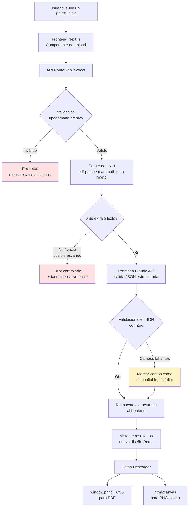

# architecture.md — Arquitectura del sistema

## Resumen

Next.js (TypeScript, App Router) full-stack desplegado en Vercel. Extracción híbrida: parsing de
texto del PDF/DOCX + API de Claude (modelo Haiku) para estructurar los campos en JSON, validado con
Zod. Sin base de datos para el flujo principal. Descarga vía impresión nativa del navegador (PDF) y
`html2canvas` (PNG).

## Diagrama de flujo

## Componentes por capa

- **Frontend**: Next.js App Router + TypeScript + Tailwind. Componente de upload con drag & drop,
  estados de carga, vista de resultados, estados de error por campo.
- **Backend**: API Routes de Next.js (funciones serverless en Vercel), no un servicio separado.
- **Extracción**: pipeline en `/lib/extraction` — parsing de texto → prompt a Claude con schema fijo
  → validación con Zod → normalización de confianza por campo.
- **Base de datos**: ninguna para el MVP. Flujo completamente stateless.
- **Autenticación**: ninguna (fuera de alcance del reto).
- **Descarga**: `window.print()` con hoja de estilos `@media print` dedicada (PDF, nativo, sin
  dependencias pesadas); `html2canvas` en cliente para PNG (extra).
- **Manejo de errores**: try/catch en cada paso del pipeline, con `errorType` específico devuelto al
  frontend (ver `conventions.md`).
- **Logging**: `console.error` con contexto de paso; Vercel captura logs de función automáticamente.
  Sin herramienta de observabilidad externa (fuera de alcance para este proyecto).
- **Variables de entorno**: `ANTHROPIC_API_KEY` en Vercel dashboard + `.env.local` en desarrollo +
  `.env.example` versionado (nunca con valores reales).
- **Seguridad**: validación de tipo MIME y tamaño de archivo antes de procesar; API key nunca
  expuesta al cliente; sanitización de texto extraído antes de insertarlo en el DOM.

## Por qué estas decisiones (para el README)

- **Next.js full-stack en vez de frontend/backend separados**: un solo repo, un solo deploy, elimina
  CORS y reduce el riesgo de "funciona en mi máquina pero no en producción".
- **Extracción híbrida (parser + LLM) en vez de solo regex o solo LLM**: el parser da el texto de
  forma barata y determinística; el LLM resuelve el problema real — estructurar texto libre y
  variable en formatos de CV distintos — sin escribir cientos de reglas regex frágiles.
- **Sin Puppeteer para la descarga**: es pesado y lento en funciones serverless gratuitas, y es la
  pieza con mayor probabilidad de romperse en producción. `window.print()` + CSS es nativo y
  confiable.
